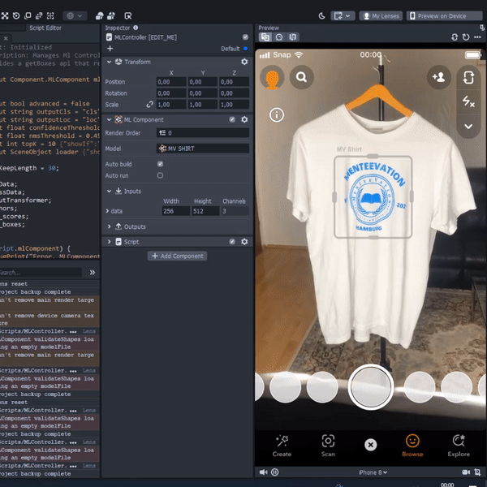
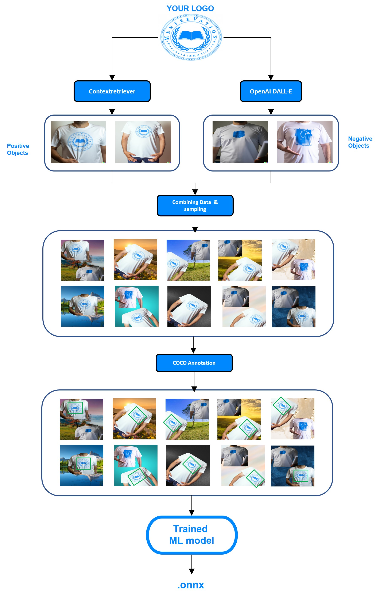

#### This project is still in active development

# Real-time Object Detection for unique products in Augmented Reality

Here we introduce a method to create an object detection model for unique products based on the state-of-art Deep Learning model ([CenterNet](https://arxiv.org/pdf/1904.07850.pdf)).
The system takes an input and creates context information around it and negative examples based on OpenAI DALL-E, so the model can generalize on many different use cases. The positive and negative objects are combined randomly and randomly sampled into a fixed sized image. The annotation is then done by the [COCO](https://cocodataset.org/#home) annotation format, which is currently done in a manual fashion.

The annotated dataset is then trained for the Detector model, which is then converted to an .ONNX file. We chose CenterNet as a Detector model, since it shows great performance in many Augmented Reality use cases. Accuracy and performance in Augmented Reality is really important, because real-time object detection as well as 3D object projection can be really resource consuming. Thus, the .ONNX model is comparably really small to other models (around 300-900 Kilobytes) and therefore is compact and applicable in many platforms. 

An example usage of our results  was applied on Lens Studio (Snapchat Lenses), which can be seen on the section "Example usage".

## Example usage for Lens Studio (Snapchat)

## System Architecture

